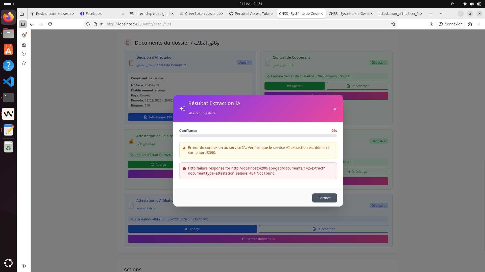

# CAHIER DES CHARGES - PHASE 2
## Système de Gestion de la Mise en Disponibilité Spéciale - CNSS Bureau Tunis

**Projet:** Mise en Disponibilité Spéciale (عدم المباشرة الخاصة)  
**Base légale:** Loi n°16 de 2003 - Mémoire de travail n°8/أ/2011  
**Application:** Indépendante de l'application Coopération Technique  

---

## TABLE DES MATIÈRES

1. [Introduction](#1-introduction)
2. [Acteurs et Rôles](#2-acteurs-et-rôles)
3. [Cadre Réglementaire](#3-cadre-réglementaire)
4. [Entités et Modèle de Données](#4-entités-et-modèle-de-données)
5. [Modules Fonctionnels](#5-modules-fonctionnels)
6. [Impressions et Documents Officiels](#6-impressions-et-documents-officiels)
7. [Workflow Global](#7-workflow-global)
8. [Architecture Technique](#8-architecture-technique)
9. [Exigences de Sécurité](#9-exigences-de-sécurité)

---

## 1. INTRODUCTION

### 1.1 Contexte
La Mise en Disponibilité Spéciale est un régime de couverture sociale pour les **agents publics** mis en disponibilité conformément à la **Loi n°16 de 2003**. Ce système permet à ces agents de maintenir leur couverture sociale pendant la période de mise en disponibilité.

L'application legacy actuelle (VB/Oracle) est utilisée par le **Bureau CNSS de Tunis**. Ce cahier des charges décrit la refonte en application web moderne, indépendante de l'application Coopération Technique ATCT.

### 1.2 Objectifs
- Dématérialisation complète du processus
- Automatisation du calcul et de la génération des cotisations trimestrielles
- Espace personnel pour les assurés et les employeurs
- Suivi en temps réel des paiements et arriérés
- Génération automatique des avis et notifications officielles
- Traçabilité complète

### 1.3 Périmètre
1. Dépôt du dossier (documents et pièces justificatives)
2. Enregistrement de l'agent public et de l'institution employeur
3. Gestion des périodes d'ilhaq (إلحاق)
4. Calcul et génération des cotisations trimestrielles
5. Suivi des paiements (part employeur + part agent)
6. Notifications et relances officielles
7. Impressions de documents officiels

---

## 2. ACTEURS ET RÔLES

| Acteur | Rôle Système | Description |
|--------|-------------|-------------|
| **Agent CNSS** | `agentCnssMiseEnDisponibilite` | Gère les dossiers, scanne documents, génère cotisations, met à jour paiements, imprime avis |
| **Assuré** (Agent Public) | `assureMiseEnDisponibilite` | Consulte son dossier, ses cotisations, son historique de paiements |
| **Employeur** (Institution) | `employerMiseEnDisponibilite` | Consulte cotisations de ses agents, effectue paiements part patronale |

### Agent CNSS - Responsabilités
- **Dépôt dossier:** Reçoit et enregistre les documents physiques (Déclaration/تصريح, Attestation salaire/شهادة الأجر, مقرر الإعلام)
- **Scan documents:** Numérise les pièces via GED
- **Enregistrement:** Saisie données agent + institution
- **Gestion ilhaq:** Enregistre les périodes de rattachement (plusieurs ilhaq possibles)
- **Salaires:** Mise à jour avec date d'effet
- **Cotisations:** Génère les cotisations trimestrielles
- **Paiements:** Enregistre les paiements reçus
- **Impressions:** Génère les documents officiels

---

## 3. CADRE RÉGLEMENTAIRE

### 3.1 Codes de Cotisation

| Code | Libellé | Payeur | Taux Actuel |
|------|---------|--------|-------------|
| **137** | Cotisation patronale (régime de base) | Employeur | **17.07%** |
| **138** | Cotisation salariale (régime de base) | Assuré | **9.68%** |
| **197** | Cotisation patronale (régime complémentaire) | Employeur | Variable |
| **198** | Cotisation salariale (régime complémentaire) | Assuré | Variable |

### 3.2 Historique des Taux

| Période | Code 137 | Code 138 | Total |
|---------|----------|----------|-------|
| 01/07/2007 - 30/06/2008 | 16.57% | 7.75% | 24.32% |
| 01/07/2008 - 30/06/2009 | 16.57% | 8.25% | 24.82% |
| 01/07/2009 - 30/06/2010 | 16.57% | 8.75% | 25.32% |
| 01/07/2010 - 30/06/2011 | 16.57% | 9.18% | 25.75% |
| À partir du 01/07/2011 | 17.07% | 9.68% | 26.75% |

### 3.3 Formule de Calcul
```
Part Employeur (Code 137) = Salaire Mensuel × 3 × 17.07%
Part Assuré   (Code 138) = Salaire Mensuel × 3 × 9.68%
Total Trimestre           = Salaire Mensuel × 3 × 26.75%
```

Le taux applicable dépend de la période de la cotisation (voir historique).

---

## 4. ENTITÉS ET MODÈLE DE DONNÉES

### 4.1 Institution / Employeur (المؤسسة المشغلة)

| Champ | Type | Description | Exemple |
|-------|------|-------------|---------|
| `id` | Long | Identifiant technique | Auto |
| `numAffiliation` | String | رقم الانخراط | `64759` |
| `brancheSociale` | String | الشعبة الاجتماعية | `60` |
| `raisonSociale` | String | Nom institution | `وزارة التربية` |
| `adresse` | String | Adresse | - |
| `telephone` | String | Téléphone | - |
| `email` | String | Email | - |
| `gouvernorat` | String | Gouvernorat | `Tunis` |
| `actif` | Boolean | Statut | `true` |

**Identifiant métier:** `numAffiliation/brancheSociale` (ex: `64759/60`)

### 4.2 Agent Public (العون العمومي)

| Champ | Type | Description | Exemple |
|-------|------|-------------|---------|
| `id` | Long | Identifiant technique | Auto |
| `numInscription` | String | رقم التسجيل | `16078805` |
| `codeExploitation` | String | رقم الاستغلال | `138` |
| `nom` / `prenom` | String | Nom/Prénom AR | `بن علي محمد` |
| `nomFr` / `prenomFr` | String | Nom/Prénom FR | `BEN ALI Mohamed` |
| `dateNaissance` | Date | Date naissance | - |
| `cin` | String | N° CIN | - |
| `adresse` | String | Adresse | - |
| `email` | String | Email | - |
| `institutionId` | Long | FK Institution | - |

### 4.3 Ilhaq / Période de Rattachement (الإلحاق)

**Un agent peut avoir plusieurs ilhaq successifs.**

| Champ | Type | Description | Exemple |
|-------|------|-------------|---------|
| `id` | Long | ID | Auto |
| `agentPublicId` | Long | FK Agent | - |
| `institutionId` | Long | FK Institution | - |
| `dateDebut` | Date | تاريخ الالحاق | `2024-01-01` |
| `dateFin` | Date | تاريخ الانتهاء | `2025-12-31` |
| `dateIhala` | Date | Date décision إحالة | `2023-12-15` |
| `referenceArrete` | String | N° arrêté | `2024/123` |
| `actif` | Boolean | En cours | `true` |

### 4.4 Salaire (الأجر)

| Champ | Type | Description |
|-------|------|-------------|
| `id` | Long | ID |
| `agentPublicId` | Long | FK Agent |
| `salaireMensuel` | BigDecimal | الأجر الشهري |
| `dateEffet` | Date | تاريخ الفاعلية |

### 4.5 Cotisation (المساهمة)

| Champ | Type | Description |
|-------|------|-------------|
| `id` | Long | ID |
| `agentPublicId` | Long | FK Agent |
| `institutionId` | Long | FK Institution |
| `ilhaqId` | Long | FK Ilhaq |
| `trimestre` | Integer | الثلاثية (1-4) |
| `annee` | Integer | السنة |
| `salaireMensuelApplique` | BigDecimal | Salaire utilisé |
| `montantCode137` | BigDecimal | Part patronale |
| `montantCode138` | BigDecimal | Part salariale |
| `montantCode197` | BigDecimal | Complémentaire patronale |
| `montantCode198` | BigDecimal | Complémentaire salariale |
| `montantTotal` | BigDecimal | المبلغ المستوجب |
| `statut` | Enum | `EN_ATTENTE`, `PARTIELLEMENT_PAYE`, `PAYE`, `EN_RETARD` |

### 4.6 Paiement (الخلاص)

| Champ | Type | Description |
|-------|------|-------------|
| `id` | Long | ID |
| `cotisationId` | Long | FK Cotisation |
| `montantPaye` | BigDecimal | المبلغ |
| `codePaiement` | String | 137 ou 138 |
| `typePaiement` | Enum | `VIREMENT`, `CHEQUE`, `ESPECES` |
| `referencePaiement` | String | Référence |
| `datePaiement` | Date | Date |

### 4.7 Document GED

Types de documents: `DECLARATION`, `ATTESTATION_SALAIRE`, `MOGARER_IAALEM`, `ARRETE_DISPONIBILITE`, `CIN`, `AUTRE`

---

Voir **CAHIER_DES_CHARGES_MISE_EN_DISPONIBILITE_PART2.md** pour les modules fonctionnels, workflow, architecture et sécurité.
