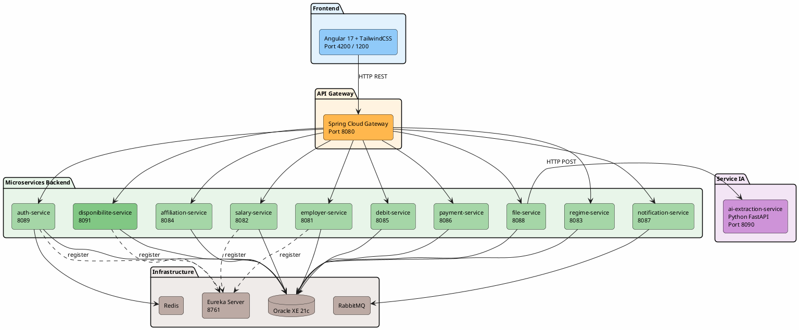
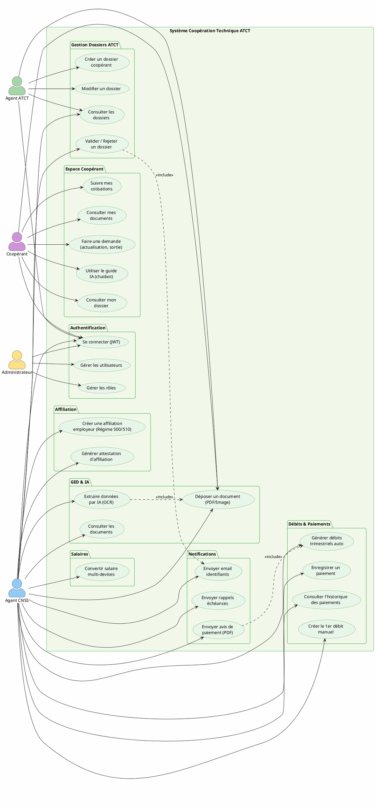
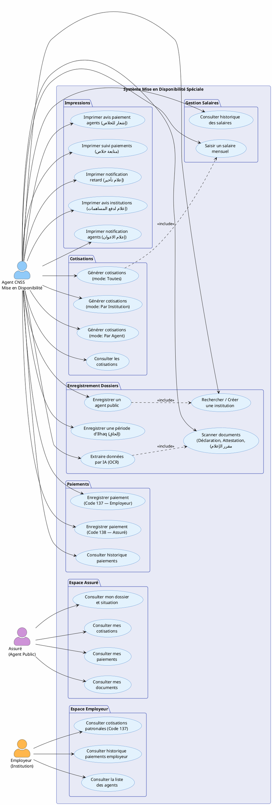
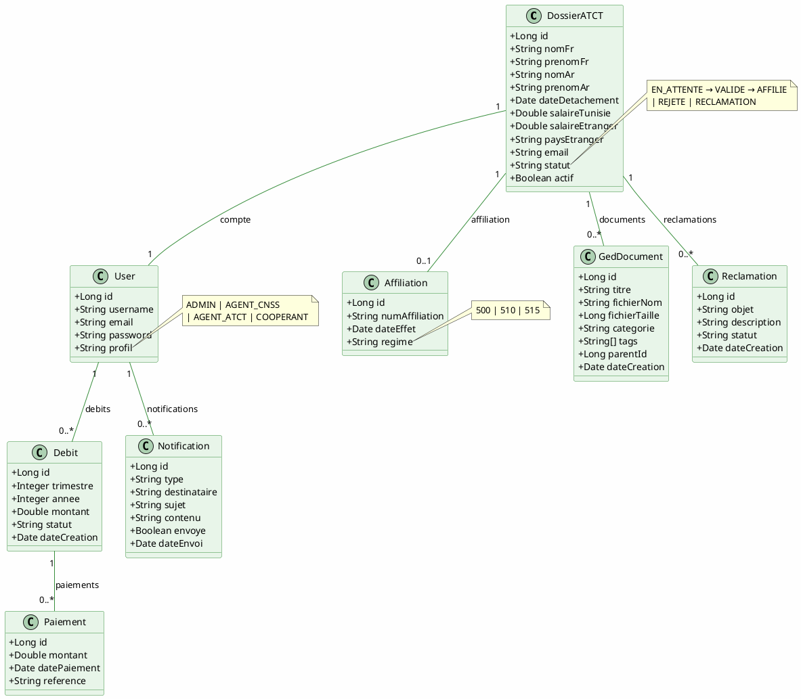
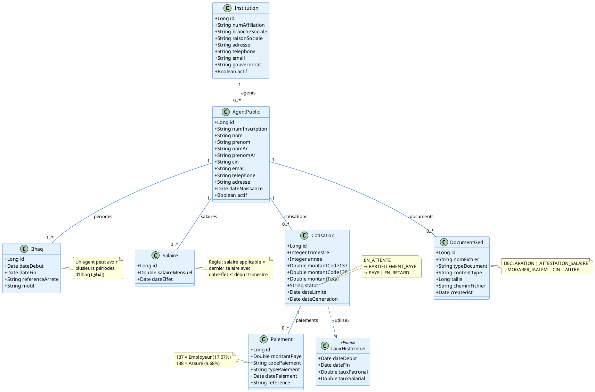
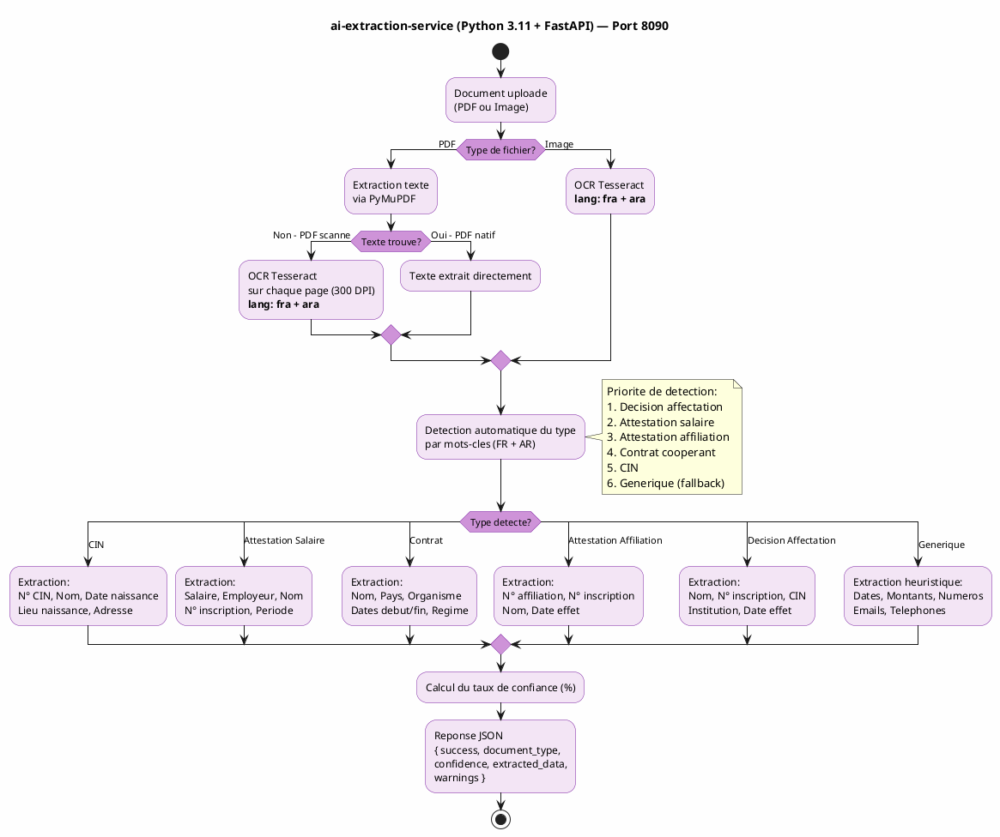
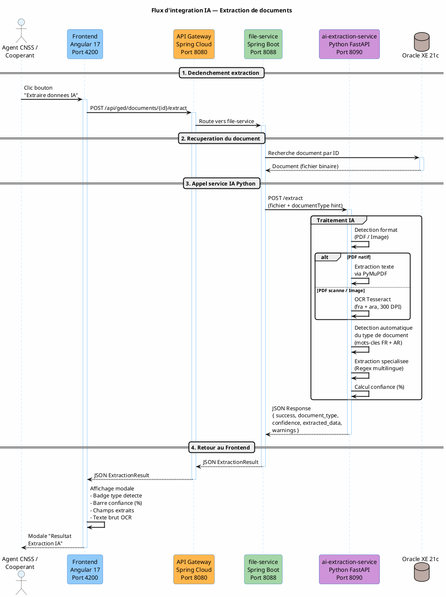

# PRÉSENTATION DE STAGE
## Système de Gestion de la Coopération Technique et Mise en Disponibilité Spéciale
### CNSS - Caisse Nationale de Sécurité Sociale

**Stagiaire :** Sahar Gaiche
**Encadrant :** [Nom de l'encadrant]
**Période :** Décembre 2025 - Mai 2026
**Durée présentation :** ~20 minutes

---

# PLAN DE LA PRÉSENTATION

| # | Section | Durée |
|---|---------|-------|
| 1 | Introduction | 1 min |
| 2 | Description du Sujet | 4 min |
| 3 | Méthodologie Adoptée | 3 min |
| 4 | Conception | 5 min |
| 5 | Travail Réalisé | 6 min |
| 6 | Conclusion et Perspectives | 1 min |

---

# 1. INTRODUCTION (1 min)

## Organisme d'accueil

La **Caisse Nationale de Sécurité Sociale (CNSS)** est un établissement public tunisien chargé de la gestion des régimes de sécurité sociale. Elle assure la couverture de millions de travailleurs, y compris ceux détachés à l'étranger et les agents publics mis en disponibilité.

## Cadre du stage

Le stage s'inscrit dans la **modernisation des systèmes d'information** de la CNSS. Deux applications legacy (Visual Basic / Oracle) nécessitaient une refonte complète en applications web modernes :

| Existant (Legacy) | Nouveau système développé |
|---|---|
| Application VB — Coopération Technique | **Phase 1** — Application web Coopération Technique ATCT |
| Application VB — Bureau CNSS Tunis | **Phase 2** — Application web Mise en Disponibilité Spéciale |

---

# 2. DESCRIPTION DU SUJET (4 min)

## 2.1 Problématique

La CNSS fait face à plusieurs défis dans la gestion de ces deux activités :

- **Gestion manuelle et dispersée** des dossiers sur des applications obsolètes (VB6)
- **Absence de traçabilité** complète des opérations
- **Aucun espace en ligne** pour les coopérants, assurés et employeurs
- **Calculs manuels** des cotisations et débits trimestriels
- **Pas de GED** — documents papier uniquement, aucune dématérialisation
- **Notifications manuelles** — courrier postal, pas d'emails automatiques
- **Difficulté de suivi** des paiements, arriérés et relances

## 2.2 Objectifs

| Objectif | Description |
|----------|-------------|
| **Dématérialisation** | Numériser l'ensemble des processus de gestion |
| **Automatisation** | Calcul automatique des cotisations, débits trimestriels, notifications |
| **Espaces personnels** | Portails web pour coopérants, assurés et employeurs |
| **GED + IA** | Gestion Électronique des Documents avec extraction IA (OCR) |
| **Traçabilité** | Journal d'audit complet de toutes les opérations |
| **Sécurité** | Authentification JWT, chiffrement, contrôle d'accès par rôle |

## 2.3 Phase 1 — Coopération Technique ATCT

La **Coopération Technique** concerne les travailleurs tunisiens détachés à l'étranger via l'**ATCT**. Ces coopérants doivent maintenir leur couverture sociale CNSS pendant leur détachement.

**Acteurs :**

| Acteur | Rôle |
|--------|------|
| **Agent ATCT** | Crée les dossiers coopérants, saisit les informations de détachement |
| **Agent CNSS** | Valide les dossiers, crée les affiliations, gère débits et paiements |
| **Administrateur** | Gestion des utilisateurs et paramétrage système |
| **Coopérant** | Dépose ses documents, consulte son espace, suit ses cotisations |

**Régimes gérés :** Régime 500 (standard), Régime 510 (complémentaire), Régime 515 (cas particuliers)

**Workflow principal :**

```
Agent ATCT → Création dossier → Validation Agent CNSS → Email identifiants
    → Coopérant se connecte → Dépôt documents GED (CIN, Contrat, Attestation)
    → Agent CNSS → Affiliation (Régime 500/510) → 1er Débit manuel
    → Système → Débits trimestriels automatiques → Avis paiement email (PDF)
    → Coopérant → Demandes : Actualisation salaire, Sortie régime, Rachat Loi 105
```

## 2.4 Phase 2 — Mise en Disponibilité Spéciale

Application **indépendante** pour la gestion de la couverture sociale des **agents publics** mis en disponibilité, conformément à la **Loi n°16 de 2003**.

**Acteurs :**

| Acteur | Rôle |
|--------|------|
| **Agent CNSS** | Gestion complète : dossiers, cotisations, paiements, impressions |
| **Assuré** (Agent Public) | Consultation dossier, cotisations, historique paiements |
| **Employeur** (Institution) | Consultation cotisations patronales et paiements |

**Codes de cotisation :**

| Code | Libellé | Payeur | Taux |
|------|---------|--------|------|
| **137** | Cotisation patronale | Employeur | **17.07%** |
| **138** | Cotisation salariale | Assuré | **9.68%** |
| **197/198** | Complémentaires | Employeur/Assuré | Variable |

**Formule :** `Montant Trimestriel = Salaire Mensuel × 3 × Taux (selon période historique)`

**Workflow principal :**

```
Agent CNSS → Réception documents → Enregistrement (Institution + Agent + Ilhaq)
    → Scan GED (Déclaration, Attestation salaire, مقرر الإعلام)
    → Saisie salaire → Génération cotisations (3 modes)
    → Paiements (Code 137 employeur + Code 138 assuré)
    → Impressions (5 types de documents officiels)
```

## 2.5 Besoins Fonctionnels

### Phase 1 — Coopération Technique

| ID | Besoin fonctionnel | Priorité |
|----|-------------------|----------|
| **BF1.1** | Authentification sécurisée (login/mot de passe) avec gestion des rôles (Admin, Agent CNSS, Agent ATCT, Coopérant) | Haute |
| **BF1.2** | Création et validation des dossiers coopérants ATCT (saisie bilingue FR/AR) | Haute |
| **BF1.3** | Gestion du cycle de vie du dossier (EN_ATTENTE → VALIDE → AFFILIE / REJETE) | Haute |
| **BF1.4** | Création d'affiliation employeur (Régime 500, 510, 515) | Haute |
| **BF1.5** | Calcul et génération automatique des débits trimestriels | Haute |
| **BF1.6** | Enregistrement et suivi des paiements | Haute |
| **BF1.7** | GED : dépôt, catégorisation et consultation des documents (PDF, images) | Haute |
| **BF1.8** | Extraction intelligente des données depuis les documents (IA / OCR) | Moyenne |
| **BF1.9** | Envoi automatique de notifications email (identifiants, avis paiement, rappels) | Haute |
| **BF1.10** | Espace Coopérant : consultation dossier, cotisations, documents, demandes | Moyenne |
| **BF1.11** | Dashboard statistique (dossiers, documents, paiements) | Moyenne |
| **BF1.12** | Convertisseur de salaires multi-devises avec taux actualisés | Basse |
| **BF1.13** | Guide IA multilingue (chatbot FR/AR/EN) pour l'assistance coopérant | Basse |

### Phase 2 — Mise en Disponibilité Spéciale

| ID | Besoin fonctionnel | Priorité |
|----|-------------------|----------|
| **BF2.1** | Enregistrement des institutions (numAffiliation, brancheSociale, raison sociale) | Haute |
| **BF2.2** | Enregistrement des agents publics (nom FR/AR, CIN, N° inscription) | Haute |
| **BF2.3** | Gestion des périodes d'Ilhaq (plusieurs périodes par agent, dates début/fin) | Haute |
| **BF2.4** | Saisie et historique des salaires mensuels avec date d'effet | Haute |
| **BF2.5** | Génération automatique des cotisations trimestrielles (3 modes : toutes / par institution / par agent) | Haute |
| **BF2.6** | Application des taux historiques (code 137 = 17.07%, code 138 = 9.68%) | Haute |
| **BF2.7** | Enregistrement des paiements (code 137 employeur, code 138 assuré) avec paiements partiels | Haute |
| **BF2.8** | Scan GED avec extraction IA des documents (Déclaration, Attestation salaire, مقرر الإعلام) | Moyenne |
| **BF2.9** | Impressions officielles (5 types : avis paiement agents, suivi, notification retard, avis institutions, notification agents) | Haute |
| **BF2.10** | Espace Assuré : consultation dossier, cotisations, paiements, documents | Moyenne |
| **BF2.11** | Espace Employeur : consultation agents, cotisations patronales, paiements | Moyenne |
| **BF2.12** | Relance automatique des institutions en retard de paiement | Moyenne |

## 2.6 Besoins Non Fonctionnels

| ID | Besoin non fonctionnel | Catégorie | Description |
|----|----------------------|-----------|-------------|
| **BNF1** | Sécurité | Authentification | JWT (JSON Web Token) avec refresh token, expiration configurable |
| **BNF2** | Sécurité | Autorisation | Contrôle d'accès par rôle (RBAC) — chaque endpoint protégé selon le profil |
| **BNF3** | Sécurité | Chiffrement | HTTPS/TLS en production, mots de passe hashés (BCrypt) |
| **BNF4** | Performance | Temps de réponse | < 2 secondes pour les opérations courantes, < 10s pour l'extraction IA |
| **BNF5** | Scalabilité | Architecture | Microservices indépendants, déployables et scalables individuellement |
| **BNF6** | Disponibilité | Résilience | Redémarrage automatique des conteneurs (`restart: always`), service discovery Eureka |
| **BNF7** | Maintenabilité | Modularité | 13 microservices avec responsabilités claires, couplage faible |
| **BNF8** | Ergonomie | Interface | Interface bilingue (Français / Arabe), support RTL, responsive design |
| **BNF9** | Ergonomie | Accessibilité | Interface web accessible depuis tout navigateur moderne (Chrome, Firefox, Edge) |
| **BNF10** | Portabilité | Conteneurisation | Déploiement Docker — même comportement en développement et production |
| **BNF11** | Interopérabilité | API REST | Communication inter-services via HTTP/JSON, documentation Swagger/OpenAPI |
| **BNF12** | Fiabilité | Données | Base de données Oracle avec intégrité référentielle, protection contre les doublons de cotisation |
| **BNF13** | Traçabilité | Audit | Journal d'audit des opérations critiques (connexions, modifications dossiers) |

---

# 3. MÉTHODOLOGIE ADOPTÉE (3 min)

## 3.1 Approche Agile itérative

```
Sprint 1 (Déc 2025)  → Analyse des besoins, Conception, Infrastructure
Sprint 2 (Jan 2026)  → Auth Service, Gateway, Eureka, Frontend base
Sprint 3 (Fév 2026)  → Modules Coopérants, Affiliation, Salaires, GED
Sprint 4 (Mar 2026)  → Débits automatiques, Paiements, Notifications
Sprint 5 (Avr 2026)  → Phase 2 (Mise en Disponibilité) + Service IA Python
Sprint 6 (Mai 2026)  → Tests, Corrections, Intégration, Déploiement
```

## 3.2 Processus de développement

```
Analyse cahier des charges → Conception UML → Backend (Spring Boot)
    → Frontend (Angular 17) → Service IA (Python) → Tests → Déploiement Docker
```

## 3.3 Outils et environnement

| Catégorie | Outil |
|-----------|-------|
| **IDE** | IntelliJ IDEA / VS Code |
| **Versioning** | Git / GitHub |
| **Conteneurisation** | Docker / Docker Compose |
| **Base de données** | Oracle XE 21c |
| **Tests API** | Postman swager
| **Diagrammes** | PlantUML / Draw.io |

## 3.4 Stack technologique

| Couche | Technologie |
|--------|-------------|
| **Frontend** | Angular 17 + TailwindCSS |
| **Backend** | Spring Boot 3.2 + Java 17 |
| **IA / OCR** | Python 3.11 + FastAPI + Tesseract OCR |
| **Base de données** | Oracle XE 21c |
| **Gateway** | Spring Cloud Gateway |
| **Discovery** | Eureka Server |
| **Messagerie** | RabbitMQ |
| **Cache** | Redis |
| **Conteneurs** | Docker + Docker Compose |

---

# 4. CONCEPTION (5 min)

## 4.1 Architecture Microservices

**Code PlantUML** (coller dans https://www.plantuml.com/plantuml/uml/) :



## 4.2 Liste des 13 microservices

| # | Service | Port | Rôle |
|---|---------|------|------|
| 1 | **eureka-server** | 8761 | Service Discovery |
| 2 | **gateway-service** | 8080 | API Gateway — point d'entrée unique |
| 3 | **auth-service** | 8089 | Authentification JWT, gestion utilisateurs |
| 4 | **employer-service** | 8081 | Dossiers ATCT, coopérants, employeurs |
| 5 | **salary-service** | 8082 | Conversion salaires, calcul cotisations |
| 6 | **regime-service** | 8083 | Paramétrage régimes (500, 510, 515) |
| 7 | **affiliation-service** | 8084 | Affiliations et attestations |
| 8 | **debit-service** | 8085 | Débits trimestriels automatiques |
| 9 | **payment-service** | 8086 | Gestion paiements |
| 10 | **notification-service** | 8087 | Emails et notifications |
| 11 | **file-service** | 8088 | GED + appel service IA |
| 12 | **ai-extraction-service** | 8090 | Python — OCR + extraction intelligente |
| 13 | **disponibilite-service** | 8091 | Phase 2 — Mise en Disponibilité Spéciale |

## 4.3 Diagramme de Cas d'Utilisation — Phase 1 (Coopération Technique)

**Code PlantUML** (coller dans https://www.plantuml.com/plantuml/uml/) :



## 4.4 Diagramme de Cas d'Utilisation — Phase 2 (Mise en Disponibilité)

**Code PlantUML** :



## 4.5 Diagramme de Classes — Phase 1 (Coopération Technique)

**Code PlantUML** :



Statuts dossier : `EN_ATTENTE` → `VALIDE` → `AFFILIE` | `REJETE` | `RECLAMATION`

## 4.6 Diagramme de Classes — Phase 2 (Mise en Disponibilité)

**Code PlantUML** :



Statuts cotisation : `EN_ATTENTE` → `PARTIELLEMENT_PAYE` → `PAYE` | `EN_RETARD`

**Formule cotisation :** `Montant Trimestriel = Salaire Mensuel × 3 × Taux (selon TauxHistorique de la période)`

## 4.7 Conception du Service IA (Python)

**Code PlantUML** :



**6 types de documents reconnus automatiquement :**

| # | Type | Champs extraits |
|---|------|-----------------|
| 1 | **CIN** (بطاقة التعريف) | N° CIN, Nom, Date/Lieu naissance, Adresse |
| 2 | **Attestation Salaire** (شهادة الأجر) | Salaire, Employeur, Nom, N° inscription, Période |
| 3 | **Contrat Coopérant** (عقد التعاون) | Nom, Pays, Organisme étranger, Dates, Régime |
| 4 | **Attestation Affiliation** (شهادة الإنخراط) | N° affiliation, N° inscription, Nom, Date effet |
| 5 | **Décision Affectation** (مقرر الإلحاق) | Nom, N° inscription, CIN, Institution, Date effet |
| 6 | **Générique** | Dates, Montants, Numéros, Emails, Téléphones |

**Stack Python :** FastAPI 0.104, pytesseract 0.3.10, PyMuPDF 1.23.7, Pillow 10.1, Pydantic 2.5

## 4.8 Flux d'intégration IA

**Code PlantUML** :



---

# 5. TRAVAIL RÉALISÉ (6 min)

## 5.1 Phase 1 — Modules Coopération Technique

### Module Authentification et Sécurité
- Connexion sécurisée JWT avec refresh token
- 3 rôles : Administrateur, Agent CNSS, Coopérant
- Gestion des sessions actives et journal d'audit

### Module Dossier ATCT
- Formulaire complet de création (bilingue FR/AR)
- Pays de détachement, période, salaire Tunisie/Étranger + conversion TND
- Validation par Agent CNSS + envoi automatique email identifiants
- Statuts : EN_ATTENTE → VALIDE → AFFILIE | REJETE | RECLAMATION

### Module GED (Gestion Électronique des Documents)
- Upload documents (PDF, images) avec catégorisation et tags
- Arborescence documents parent/enfant par dossier
- **Intégration IA** : bouton "Extraire données IA" sur chaque document
- Modale résultat : type détecté, barre de confiance (%), champs extraits

### Module Affiliation Employeur
- Attribution numéro employeur (Régime 500/510)
- Génération attestation d'affiliation
- Onglets : Employeur, Adresse, Responsable Légal

### Module Création des Débits
- 1er débit manuel par l'Agent CNSS
- **Débits automatiques trimestriels** via Scheduler cron
- Calcul selon salaire déclaré et taux applicables
- Envoi automatique avis de paiement (Email + PDF)

### Module Paiements et Carte Salaire
- Enregistrement des paiements reçus
- Suivi des échéances et validation salaires

### Module Dashboard
- 5 cartes statistiques : Total, En Attente, Validés, Affiliés, Retours CNSS
- Compteur documents GED, dossiers récents, actions rapides

### Module Espace Coopérant
- Dashboard personnel avec statut du dossier
- Suivi dossier en temps réel
- **Guide IA multilingue** (Chatbot FR/AR/EN) pour les démarches

### Module Notifications Automatiques
- Email inscription (identifiants connexion)
- Avis de paiement (PDF joint)
- Rappels (15j avant échéance, 2 trimestres impayés)
- Mailing semestriel récapitulatif

## 5.2 Phase 2 — Modules Mise en Disponibilité

### Module Enregistrement Dossiers
- Enregistrement **Institution** (recherche par numAffiliation/brancheSociale)
- Enregistrement **Agent Public** (N° inscription CNSS, nom FR/AR)
- Enregistrement **Ilhaq** (plusieurs périodes par agent)
- Scan et dépôt GED (3 documents obligatoires)

### Module Gestion des Salaires
- Saisie salaire mensuel + date d'effet
- Historique complet des salaires
- Règle : salaire applicable = dernier salaire avec dateEffet ≤ début trimestre

### Module Génération des Cotisations
- **3 modes** : Toutes / Par Institution / Par Agent
- Paramètres : Trimestre (1-4), Année, Institution, Agent
- Calcul automatique avec taux historiques
- Protection contre les doublons

### Module Paiements
- Saisie paiements (code 137 ou 138, type, référence)
- Paiements partiels possibles
- Statuts automatiques : EN_ATTENTE → PARTIELLEMENT_PAYE → PAYE | EN_RETARD

### Module Impressions (5 documents officiels)
1. Avis de paiement agents (إشعار للخلاص بالنسبة للاعوان)
2. Suivi paiements (متابعة خلاص المساهمات)
3. Notification de retard (إعلام حول تأخير المؤسسات)
4. Avis paiement institutions (إعلام لدفع المساهمات)
5. Notification agents publics (إعلام الاعوان العموميين)

### Module Espace Assuré
- Dashboard personnel, résumé situation, ilhaq en cours
- Cotisations par trimestre, historique paiements, documents, demandes

### Module Espace Employeur
- Dashboard (nombre agents, total cotisations dues)
- Liste agents, cotisations patronales (code 137), historique paiements

## 5.3 Modules IA développés en Python

### Service d'Extraction IA (ai-extraction-service)
- **Technologie :** Python 3.11, FastAPI, Tesseract OCR (français + arabe), PyMuPDF
- **Déploiement :** Conteneur Docker sur port 8090
- **Fonctionnement :**
  1. Réception du document (PDF ou Image)
  2. Extraction texte brut via OCR (Tesseract fra+ara) ou texte PDF natif
  3. Si PDF scanné → OCR sur chaque page à 300 DPI
  4. Détection automatique du type par mots-clés bilingues (FR + AR)
  5. Extraction spécialisée par Regex multilingue (patterns par type)
  6. Réponse JSON : { success, document_type, confidence %, extracted_data, warnings }
- **6 types reconnus :** CIN, Attestation salaire, Contrat, Attestation affiliation, Décision affectation, Générique
- **Intégration Frontend :**
  - Bouton "Extraire données IA" dans le détail dossier ATCT (4 documents)
  - Bouton "Extraire données IA" dans le détail document GED
  - Modale de résultat avec badge type, barre de confiance colorée, champs extraits
- **4 endpoints :** POST /extract, POST /extract-from-bytes, GET /document-types, GET /health

### Guide IA Multilingue (Chatbot Coopérant)
- **Langues :** Français, Arabe, Anglais (changement en temps réel)
- **Intégration :** Chat intégré dans l'Espace Coopérant (Angular)
- **8 thèmes couverts :**
  - Mon Dossier (dossier, ملف, file)
  - Cotisations (cotisation, مساهمة, contribution)
  - Paiements (paiement, خلاص, payment)
  - Actualisation Salaire (salaire, أجر, salary)
  - Régime Maladie (regime, مرض, health)
  - Rachat Loi 105 (rachat, استرداد, buyback)
  - Documents Requis (document, وثيقة, paper)
  - Navigation générale (fallback)
- **Interface :** Header gradient, bulles de chat, support RTL pour l'arabe, indicateur de saisie animé

## 5.4 Chiffres clés du projet

| Métrique | Valeur |
|----------|--------|
| **Microservices** | 11 Spring Boot + 2 Python IA |
| **Applications Angular** | 2 (Coopération Technique + Disponibilité) |
| **Endpoints API REST** | ~120+ |
| **Tables base de données** | ~25+ |
| **Conteneurs Docker** | 14 (services + infrastructure) |
| **Types documents IA** | 6 types reconnus automatiquement |
| **Chatbot multilingue** | 3 langues, 8 thèmes |

---

# 6. CONCLUSION ET PERSPECTIVES 

## Bilan

Durant ce stage, j'ai conçu et développé **deux applications web complètes** pour la CNSS :

- **Phase 1 — Coopération Technique ATCT :** Système complet de gestion des coopérants détachés à l'étranger, avec dématérialisation, GED avec extraction IA, notifications automatiques et espaces personnalisés.

- **Phase 2 — Mise en Disponibilité Spéciale :** Système de gestion de la couverture sociale des agents publics, avec calcul automatique des cotisations, suivi des paiements et génération de documents officiels.

- **Modules IA Python :** Service d'extraction OCR intelligent (6 types de documents, bilingue FR/AR) et chatbot multilingue d'assistance (FR/AR/EN).

## Compétences acquises

| Domaine | Compétences |
|---------|-------------|
| **Backend** | Architecture microservices, Spring Boot, Spring Cloud, JPA/Hibernate |
| **Frontend** | Angular 17, TailwindCSS, composants standalone |
| **IA / Python** | FastAPI, Tesseract OCR, extraction Regex multilingue |
| **DevOps** | Docker, Docker Compose, orchestration conteneurs |
| **Sécurité** | JWT, RBAC, chiffrement |
| **Métier** | Sécurité sociale, régimes CNSS, cotisations |

## Perspectives

- Déploiement en production sur l'infrastructure CNSS
- Intégration avec le SI existant (systèmes legacy)
- Conversion devises en temps réel (API Banque Centrale de Tunisie)
- Application mobile pour les coopérants et assurés
- Pipeline CI/CD automatisé

---

# MERCI POUR VOTRE ATTENTION

## Questions ?

---

**Stagiaire :** Sahar Gaiche
**Projet :** Système de Gestion CNSS — Coopération Technique et Mise en Disponibilité
**Technologies :** Angular 17 · Spring Boot 3.2 · Python FastAPI · Oracle XE · Docker · Microservices
**Période :** Décembre 2025 — Mai 2026
